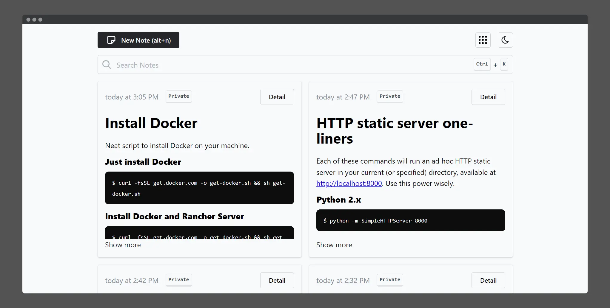

  
  <h1 align="center">Papirus</h1>

Simple but powerful note-taking app, built for people who likes simplicity.

  

    <a href="https://papirus.wastu.dev">Demo</a>
  

  
  
  

I built Papirus with **Next.js** & **Appwrite** to participate in the [hackathon competition held by Appwrite and DEV](https://dev.to/devteam/announcing-the-appwrite-hackathon-on-dev-1oc0).

# Description

Papirus is a simple note-taking app that allows you to write, edit, delete and share your notes or snippets without much friction.

Papirus was designed for individuals who didn't bother organizing their notes and relied more on the search feature. So, no more tags, labels, or folders.

Papirus is inspired by the simplicity of Google Keep and Notion's easy-to-write editor.

# Features

- WYSIWYG editor with a markdown keyboard shortcut
- Searchable notes
- Share notes publicly
- Keyboard-centric navigation
- Dark mode 🌙

# Screenshots

- [Screenshot 1](assets/screenshot1.webp)
- [Screenshot 2](assets/screenshot2.webp)
- [Screenshot 3](assets/screenshot3.webp)

# Building the app

## Set up Appwrite

- Make sure you have Appwrite installed
- Create new collections and add this attribute:
  - content: string - required
  - timestamp: string - required
  - text: string - required
- Add full-text index for `text` attribute
- Add your app url to `platforms`

## Running the project

- Copy `.env.example` to `.env` and change the values to your Appwrite credentials
- Run `yarn && yarn dev`

# Issues

If you encounter any problems, you can open an issue on [GitHub](https://github.com/bagaswastu/papirus/issues).

# License

[MIT](LICENSE.md)
